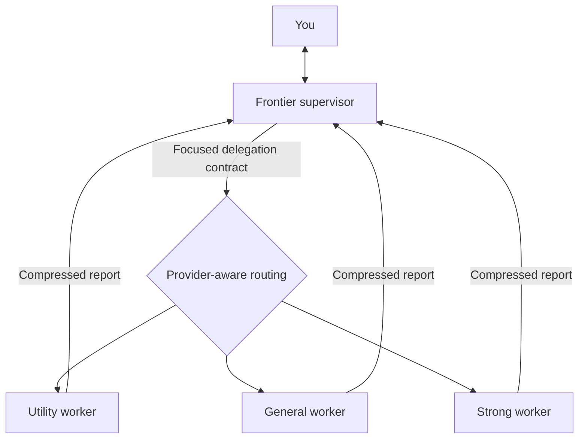

# Frontier model costing too much?

## Make it supervise.

Frontier Supervision keeps your most capable model focused on decisions. Workers handle repository inspection, commands, implementation, tests, browsing, and verification.

The supervisor receives short reports with evidence. It spends less context on mechanical work and more context on architecture, trade-offs, and conversation with you.

This skill is model-neutral. It detects the active provider and maps portable worker tiers to models that the runtime exposes.

## How it works



The supervisor performs these tasks:

- Discuss requirements and ideas with you.
- Make architectural and strategic decisions.
- Select a worker capability tier.
- Review evidence and resolve worker disagreements.
- Request independent verification for consequential changes.

Workers perform these tasks:

- Read and search files.
- Run shell, Git, build, and test commands.
- Browse or use external connectors.
- Modify code and documents.
- Return decision-relevant findings and evidence.

## Provider-aware routing

The skill reads the supervisor identity and worker catalog that the runtime provides. It does not use filesystem or web tools for detection.

If a known adapter matches, the skill uses that adapter. Otherwise, it classifies models from their runtime descriptions:

| Tier | Required capability |
|---|---|
| Utility | Fast and economical mechanical work |
| General | Balanced coding and normal investigation |
| Strong | Difficult debugging and consequential reasoning |

If the runtime gives no useful capability information, the supervisor asks you for a mapping. It does not invent model names.

The included Codex adapter maps the current catalog as follows:

| Tier | Model |
|---|---|
| Utility | `gpt-5.6-luna` |
| General | `gpt-5.6-terra` |
| Strong | `gpt-5.6-sol` |
| Supervisor | `gpt-6-astra` |

You can add another verified provider adapter in [`references/runtime-routing.md`](references/runtime-routing.md).

## Install in Codex

Clone the repository into your personal Codex skills directory:

```bash
mkdir -p ~/.codex/skills
git clone https://github.com/YOUR-NAME/frontier-supervision.git ~/.codex/skills/frontier-supervision
```

If you already cloned the repository elsewhere, copy it instead:

```bash
cp -R /path/to/frontier-supervision ~/.codex/skills/frontier-supervision
```

Start a new Codex session after installation.

The included `agents/openai.yaml` disables implicit activation. The skill runs only when you request it.

## Install in another compatible runtime

1. Copy this repository into the personal skills directory for that runtime.
2. Make sure that the runtime can load `SKILL.md` files.
3. Make sure that the runtime exposes agent dispatch.
4. Add a provider adapter if the worker catalog has no capability descriptions.

The runtime can ignore `agents/openai.yaml`. That file contains Codex-specific interface metadata only.

## Activate the skill

Name the skill in the opening request of a new session:

```text
Use $frontier-supervision for this session.
Help me design and implement the account migration.
```

The skill remains active for that session. Tell the supervisor to disable frontier supervision when you want direct tool use again.

For natural-language activation in Codex, add this small rule to your personal `AGENTS.md` file:

```md
## Frontier supervision

The `frontier-supervision` skill is explicit-only.
Activate it only when the opening request names `$frontier-supervision`
or clearly asks to use frontier supervision.
Keep it active until the user explicitly disables it.
```

Do not replace an existing `AGENTS.md` file. Add only this section.

## Delegation and return contracts

Each worker receives a focused contract. The contract includes the objective, purpose, scope, permitted actions, evidence, autonomy, and escalation conditions.

Workers do not receive the full supervisor conversation by default. Codex workers use `fork_turns: "none"` unless specific earlier turns are necessary.

Worker reports lead with the result. They summarize findings, changes, verification, uncertainty, and retrieval pointers. Raw files and large logs stay outside the supervisor context.

See these references for the complete behavior:

- [`delegation-contract.md`](references/delegation-contract.md)
- [`return-contract.md`](references/return-contract.md)
- [`routing-policy.md`](references/routing-policy.md)
- [`verification-policy.md`](references/verification-policy.md)
- [`examples.md`](references/examples.md)

## Enforcement and trade-offs

The skill uses instruction enforcement. It does not remove tools from the supervisor at the runtime level.

The policy forbids direct operational work while the skill is active. Deadlines and worker failures do not silently cancel the policy.

Worker calls add coordination time and can increase total model usage. The skill targets frontier-model context and compute, not the smallest possible number of calls.

## Repository layout

```text
frontier-supervision/
├── README.md
├── SKILL.md
├── agents/
│   └── openai.yaml
└── references/
    ├── delegation-contract.md
    ├── examples.md
    ├── return-contract.md
    ├── routing-policy.md
    ├── runtime-routing.md
    └── verification-policy.md
```
