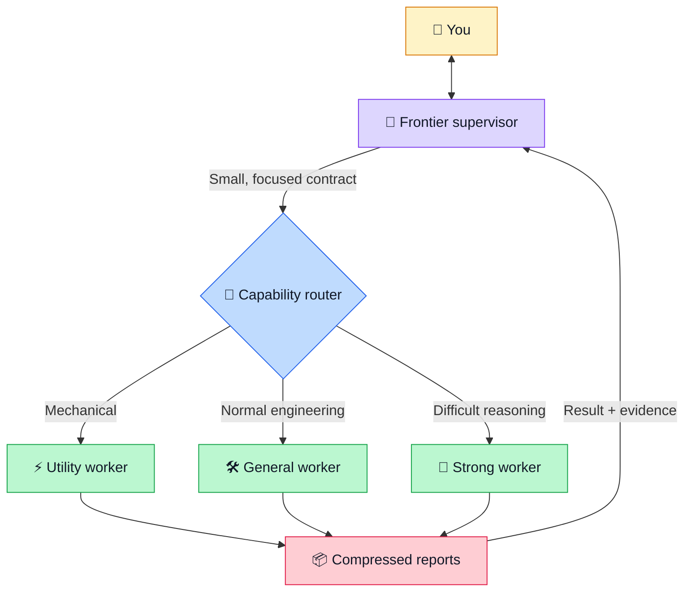

# 🧠 Your frontier model is brilliant. Why is it running `grep`?

> **Frontier model costing too much? Make it supervise.**

Your strongest model is valuable because it can reason through ambiguity, architecture, and difficult trade-offs.

Then an agentic task begins, and that same model spends its context opening files, searching symbols, reading logs, running tests, and editing boilerplate.

That is like hiring a lead engineer and asking them to carry every box in the office.

**Frontier Supervision changes the job.** The frontier model becomes your technical lead. Smaller workers inspect, implement, and verify. They return short reports with the evidence needed for the next decision.

> [!TIP]
> The goal is not delegation for its own sake. The goal is to spend frontier-model context on decisions that need frontier-level judgment.

## Table of contents

- [Why this exists](#why-this-exists)
- [What the skill does](#what-the-skill-does)
- [How it works](#how-it-works)
- [Install in Codex](#install-in-codex)
- [Activate the skill](#activate-the-skill)
- [Install in another runtime](#install-in-another-runtime)
- [Provider-aware routing](#provider-aware-routing)
- [Delegation and worker reports](#delegation-and-worker-reports)
- [Example session](#example-session)
- [Limits and trade-offs](#limits-and-trade-offs)
- [Project structure](#project-structure)

## Why this exists

A normal agent session can make the frontier model perform every kind of work:

- Search a large repository.
- Read dozens of files.
- Run commands and tests.
- Process long logs.
- Make routine edits.
- Re-read the same evidence after a worker escalates.

These tasks consume the model context that you want for planning and judgment. They can also make long sessions expensive.

Delegation alone does not fix this problem. A careless supervisor can send every worker the full conversation or choose an oversized model.

It can also accept an 8,000-line report.

Frontier Supervision adds a complete operating policy:

1. Give each worker the smallest sufficient task.
2. Select the least capable model that can complete it.
3. Pass only the context that the worker needs.
4. Require a compressed report with evidence.
5. Escalate difficult reasoning without repeating completed discovery.

> [!NOTE]
> This skill targets frontier-model context and compute. Worker calls can still increase total token usage or wall-clock time.

## What the skill does

While the skill is active, the supervisor can:

- Talk with you and clarify intent.
- Brainstorm and make plans.
- Make architectural and strategic decisions.
- Route tasks to workers.
- Review evidence and resolve disagreements.
- Decide when independent verification is necessary.

Workers handle all operational work:

- Filesystem reads and writes.
- Repository search and Git operations.
- Shell commands, builds, and tests.
- Browsing and external connectors.
- Implementation and verification.

The supervisor does not quietly take over when a worker fails. It reframes the task, selects a stronger worker, or reports the blocker.

## How it works



The supervisor repeats this loop:

```text
Decide what is missing
        ↓
Choose the smallest useful task
        ↓
Route to the least capable sufficient worker
        ↓
Receive a compressed, evidence-backed report
        ↓
Reason, decide, or delegate the next focused task
```

## Install in Codex

### Requirements

You need Codex and a Codex runtime that supports skills and subagents.

GitHub CLI is the easiest way to install this private repository.

### 1. Clone the skill

Authenticate the GitHub account that has repository access:

```bash
gh auth login
gh auth status
```

Then clone the skill:

```bash
mkdir -p "$HOME/.codex/skills"
gh repo clone iqmalje/frontier-supervision \
  "$HOME/.codex/skills/frontier-supervision"
```

> [!NOTE]
> This repository is private. GitHub must authenticate the account that has access to it.

If your Git credentials are already configured, standard Git also works:

```bash
git clone https://github.com/iqmalje/frontier-supervision.git \
  "$HOME/.codex/skills/frontier-supervision"
```

### 2. Make sure that the skill exists

Run this command:

```bash
test -f "$HOME/.codex/skills/frontier-supervision/SKILL.md" \
  && echo "Frontier Supervision is installed"
```

### 3. Start a new Codex session

Codex discovers personal skills when a new session starts.

### 4. Update the skill later

Run this command from any directory:

```bash
git -C "$HOME/.codex/skills/frontier-supervision" pull --ff-only
```

> [!IMPORTANT]
> The skill is explicit-only. Installation does not activate it for every conversation.

## Activate the skill

Name the skill in the opening request of a new session:

```text
Use $frontier-supervision for this session.
Help me investigate and fix the account migration.
```

The skill stays active until you explicitly disable it.

Add this section to your personal `AGENTS.md` file for natural-language activation:

```md
## Frontier supervision

The `frontier-supervision` skill is explicit-only.
Activate it only when the opening request names `$frontier-supervision`
or clearly asks to use frontier supervision.
Keep it active until the user explicitly disables it.
```

> [!WARNING]
> Do not replace your existing `AGENTS.md` file. Add only the section shown here.

## Install in another runtime

The core policy does not depend on OpenAI or Codex model names.

To use it with another compatible runtime:

1. Copy this repository into the runtime personal-skills directory.
2. Make sure that the runtime can load `SKILL.md`.
3. Make sure that the runtime supports subagent dispatch.
4. Expose model names and capability descriptions to the supervisor.
5. Add a provider adapter if automatic classification is not possible.

The runtime can ignore `agents/openai.yaml`. That file contains Codex interface metadata.

> [!TIP]
> Keep the portable tier names: Utility, General, Strong, and Supervisor. Change only the provider-specific model mapping.

## Provider-aware routing

On the first delegation, the supervisor reads its runtime identity and the available worker catalog.

If a known provider adapter matches, the supervisor uses it. Otherwise, it classifies the models from their runtime descriptions.

| Tier | Best fit |
|---|---|
| ⚡ Utility | File discovery, known commands, targeted tests, and mechanical edits |
| 🛠️ General | Normal investigation, implementation, and multi-file integration |
| 🔬 Strong | Difficult debugging, security judgment, concurrency, and transactions |

The included Codex adapter uses this mapping:

| Tier | Model | Typical reasoning |
|---|---|---|
| Utility | `gpt-5.6-luna` | Low or medium |
| General | `gpt-5.6-terra` | Medium or high |
| Strong | `gpt-5.6-sol` | High or xhigh |
| Supervisor | `gpt-6-astra` | Selected by the user |

If the runtime does not describe its models, the supervisor asks you for a mapping. It does not invent unavailable model names.

See [`runtime-routing.md`](references/runtime-routing.md) to add or change a provider adapter.

## Delegation and worker reports

Every worker gets a focused contract:

```text
Objective → Purpose → Required information → Known context
          → Scope → Permitted actions → Evidence
          → Verification → Autonomy → Escalation → Return format
```

Codex workers use `fork_turns: "none"` by default. This setting prevents an 80,000-token conversation from silently following a five-minute worker task.

Every worker returns a compact report:

```text
RESULT
FINDINGS
EVIDENCE
CHANGES
VERIFICATION
DEVIATIONS / UNCERTAINTIES
ESCALATION
RETRIEVAL POINTERS
```

The report gives the supervisor enough information for the next correct decision. Large logs, whole files, and broad diffs stay outside the supervisor context.

Read the detailed contracts:

- [`delegation-contract.md`](references/delegation-contract.md)
- [`return-contract.md`](references/return-contract.md)
- [`routing-policy.md`](references/routing-policy.md)
- [`verification-policy.md`](references/verification-policy.md)
- [`examples.md`](references/examples.md)

## Example session

```text
You:
Use $frontier-supervision for this session.
Does authMiddleware enforce team permissions?

Supervisor:
Delegates a bounded, read-only investigation to a Utility worker.

Utility worker:
Searches the repository and reads the relevant symbols.
Returns a short answer with file and symbol evidence.

Supervisor:
Explains the result and discusses the architectural implications with you.

You:
Implement option B.

Supervisor:
Delegates implementation to a General worker.
Requests an independent verifier because authorization is consequential.
```

The supervisor never reads the middleware, edits the code, or runs the tests directly.

## Limits and trade-offs

> [!CAUTION]
> This skill uses instruction enforcement. It does not remove tools from the supervisor at the runtime level.

The policy remains active under deadline pressure and after worker failures. Direct tool use requires an explicit user override or deactivation.

This design has trade-offs:

- Worker startup adds latency.
- Multiple workers can increase total model calls.
- Weak delegation contracts can cause repeated work.
- Provider catalogs without capability descriptions need manual mapping.
- Small tasks can feel slower because the boundary remains strict.

The benefit is a cleaner frontier-model context and a supervisor that stays focused on judgment.

## Project structure

```text
frontier-supervision/
├── README.md
├── SKILL.md
├── agents/
│   └── openai.yaml
└── references/
    ├── delegation-contract.md
    ├── examples.md
    ├── return-contract.md
    ├── routing-policy.md
    ├── runtime-routing.md
    └── verification-policy.md
```

---

**Let the frontier model think. Let the workers operate.**
